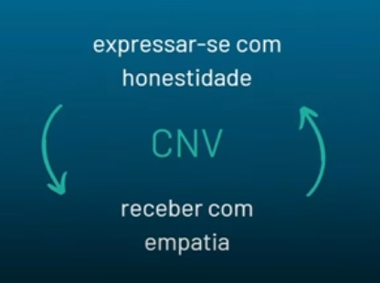

# COMUNICAÇÃO (COMUNICAÇÃO NÃO VIOLENTA, FEEDBACK)

Comunicação não violenta - téorias para aprimorar relacionamento pessoas e profissionais
Marshall B. Rosenberg


como melhorar e aprimorar a comunicação:
Comunicação de forma mais acertiva e empatica

```
"Toda violência é a expressão trágica de uma necessidade que não está sendo atendida. Um ato de violência é quase um pedido de ajuda."
```

Objectivo da CNV - "estabelecer diálogos mais "emáticos" e autênticos e conduzir conversas com mais confiança, mesmo em situações difíceis ou desafiadoras".

Não é uma metodologia que te deixa na zona de conforto.

É algo que você faz todo dia 24 horas por dia que é se comunicar

Buscar experiências boas e relações duradoras e sinseras no trabalho e nas relações pessoais


## O que é empatia?

Empatia (conceito dentro da CNV)

Ter empatia para a CNV é estar conscientimente presente ao que está **sendo dito**, buscado identificado o que está se passando **com a outra pessoa**, focando em quais são seus sentimentos e o que **ela precisa**, ou seja, quais são suas necessidades.

Empatia: 
+ Estar presente
+ Se entender e também está compreendedo o outro


É muito fácil cometer o error de interpretar o que está acontecendo com o outro apartir da sua vivência.
Isso não significa que você está capitando a mensagem do que aquela pessoa está falando. O que está escutando e visualizando é a interpretação que se tem do seu mundo.


Com a linguagem corporal da pessoa: você deve sentir a outra pessoa e entender quais são as necessidades que ela tá tempo e entender qual o contexto para entender o que ela precisa (suas necessidades)


### Como **nos** comunicamos como nós recebemos a comunicação do **outro**

O processo de se comunicar envolve: Como eu vou me comunicar e Como eu estou recebendo a comunicação do outro.

Como eu esculto o outro para não me comunicar de uma forma mais enpática e não violenta.

## Ciclo CNV



## Eu automático x Eu observador

- Eu automático -> Piloto automático (Banco de dados)

- Eu observador -> mente consiente (tomar consiencia que você vem de contextos diferentes, eu tenho minhas proprías interpretações, você tem que parar e interpretar com impatia a comunicação daquela pessoa para entender o que defato ela está tentando comunicar com a mensagem dela)

## Alguns tipos de comunicação que podem existir

|  | Construtivo | Destrutivo |
| ------------- | ------------- | ------------- |  
| Ativa  | Quem responde mostra entusiasmo, excitação, faz perguntas, se mostra interessado, reforça positivamente, leva a conversa adiante, faz contato visual e sorri.  | Quem responde endossa apenas o negativo. Encontra algum problema na questão que é dita. Sempre enxerga o lado ruim primeiro. Não apoia, mas critica.|
| Passiva  | Quem responde pode até sorrir e reconhecer, mas logo silencia como se não conseguisse render o assunto. Geralmente não tem muita expressão.  | Quem responde mostra-se desinteressado, desvia, muda de assunto e faz pouco contato visual. É como se ignorasse o que o outro acabou de dizer. |

- Você não pode simplemente responsabilizar o outro pela comunicação

## Comunicação Não-Violenta

Se a outra pessoa estiver um pouco violenta você tem que parar e notar isso para ver o que pode fazer para tornar a conversa mais produtiva. E aperfeiçoar de uma situação baixo astral.

- Observação
  
- Sentimentos

- Necessidade

- Pedido


- Observação:
  Observação não é avaliação: Quando combinamos abservação com avaliação, as pessoas tendem a receber isso como critica.

Ex:
Avaliação:
Pedro acha que precisa opinar sobre absolutamente todos os tópicos de todas as reuniões da FEJEPE. (parece um tipo de ataque da outra pessoa)

Observação:
Em 100% dos tópicos levantados nas 3 últimas reuniões gerais da FEJEOPE, Pedro se posicionou, fazendo comentários.

- Sentimentos

- Necessidade

- Pedido

14:55

FEJEPE - Federação das empresas juniores do estado de pernambuco.

Resumindo:

É preciso está consiente enquanto está comunicando
